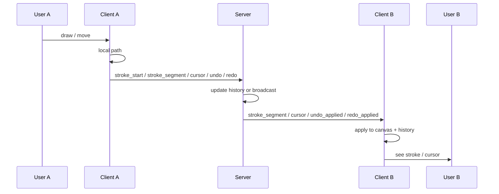

# Architecture

## Data flow

Drawing data flows: user input → client canvas + WebSocket → server → broadcast to other clients → their canvas.

- **Source of truth**: Server holds global stroke history and redo stack per room. Clients apply server events so everyone converges.
- **Real-time**: Clients send path segments (start/end) at a throttled rate (~60 Hz). No full canvas snapshots.

## WebSocket protocol

All messages are JSON: `{ event: string, data: object }`.

| Direction | Event          | Payload |
| --------- | -------------- | ------- |
| C→S       | join_room      | roomId?, userId? |
| S→C       | user_list      | users: [{ id, color }] |
| S→C       | full_state     | history, redoStack (for new joiner) |
| C→S       | stroke_start   | strokeId, tool, style |
| S→C       | stroke_start   | full stroke (id, userId, tool, style, segments) |
| C→S       | stroke_segment | strokeId, start, end |
| S→C       | stroke_segment | same (broadcast) |
| C→S       | stroke_end     | strokeId |
| S→C       | stroke_end     | strokeId |
| C→S       | cursor         | x, y |
| S→C       | cursor         | userId, x, y |
| C→S       | undo           | - |
| S→C       | undo_applied   | strokeId, userId |
| C→S       | redo           | - |
| S→C       | redo_applied   | stroke |
| S→C       | user_joined    | user, users |
| S→C       | user_left      | user, users |

We use native WebSockets (`ws` on server) to keep the stack minimal and avoid extra framing; the app only needs JSON messages and reconnect logic, which we implement in the client.

## Undo / redo strategy

- Server keeps `history[]` (ordered strokes) and `redoStack[]` per room.
- **Undo**: Client sends `undo`. Server pops the **last** stroke from `history` (whoever drew it), pushes it to `redoStack`, broadcasts `undo_applied(strokeId, userId)`. All clients remove that stroke and redraw. So one user can undo another’s drawing.
- **Redo**: Client sends `redo`. Server pops from `redoStack`, pushes back to `history`, broadcasts `redo_applied(stroke)`. Clients add the stroke and redraw.
- Order is strict FIFO on the server; clients process events in order.

## Performance

- **Segment batching**: Client throttles segment emission (e.g. every 16 ms) so we don’t send every mousemove. Local drawing still runs every move for smoothness.
- **Redraw**: Single canvas; we redraw all strokes only when history changes (new segment, undo, redo, full_state). Current stroke is drawn as part of the same stroke list so we avoid a second canvas for “in progress” stroke.
- **Cursor**: Cursor position is throttled (e.g. 100 ms) before sending so many users don’t flood the channel.
- **No images**: Only vector data (segments) is sent, not canvas bitmaps.

## Conflict handling

- No region locking. Each stroke is independent; overlapping strokes are drawn in order of arrival. We don’t resolve pixel-level conflicts; last stroke on top.
- Out-of-order: We use `strokeId`; segments are appended to the stroke created by `stroke_start`. If a segment arrives for an unknown stroke we could buffer or ignore; current implementation assumes in-order delivery.
- Reconnect: Client reconnects and sends `join_room`; server sends `full_state` so the client redraws from server state.
